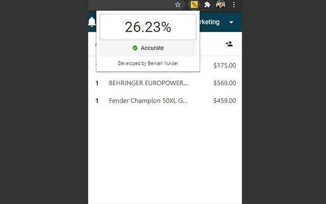
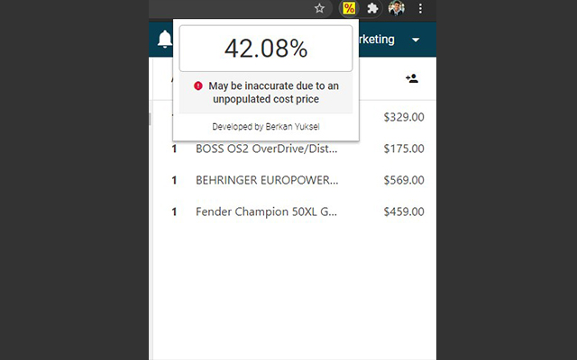
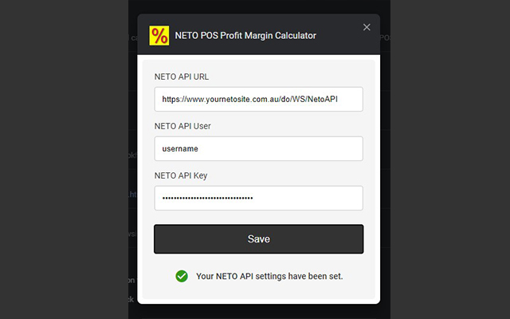

# NETO POS Profit Margin Calculator

[Find the official Google Chrome extension here.](https://chrome.google.com/webstore/detail/neto-pos-profit-margin-ca/elhpnbhaoamdcijpfpgaoiihdldphlli)

A free, open-source Chrome extension to help you with your NETO POS experience.

This extension will calculate real-time gross profit margins of multiple products in a NETO POS sales order and a NETO backend sales order.

Simply select the products your customer is purchasing and add it to the sale screen. Then, click the extension icon to fetch a real-time gross profit margin percentage on your entire order.

Sometimes, cost prices may be missing in your products. In this case, the extension provides an accuracy status of the calculation.

Setup only takes your NETO API settings, so product cost prices can be fetched from your store's inventory system.

